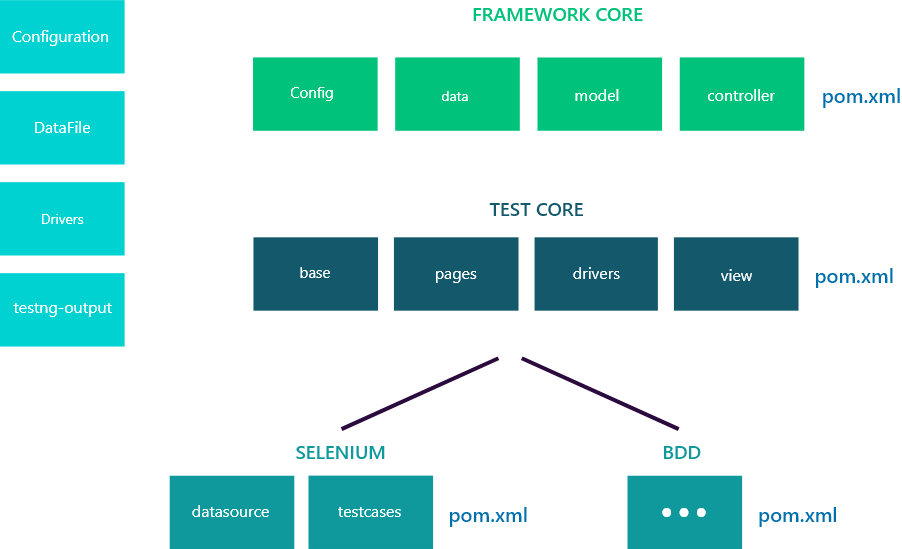
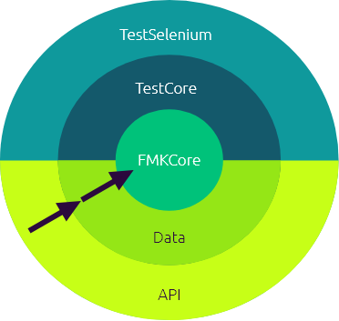
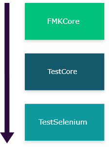
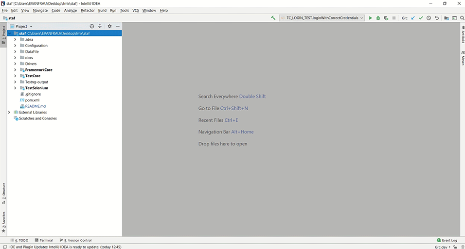
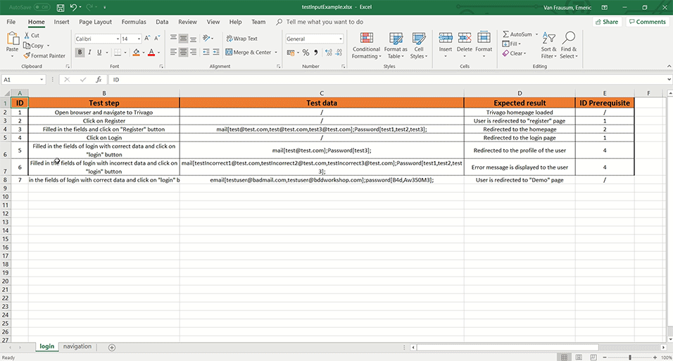
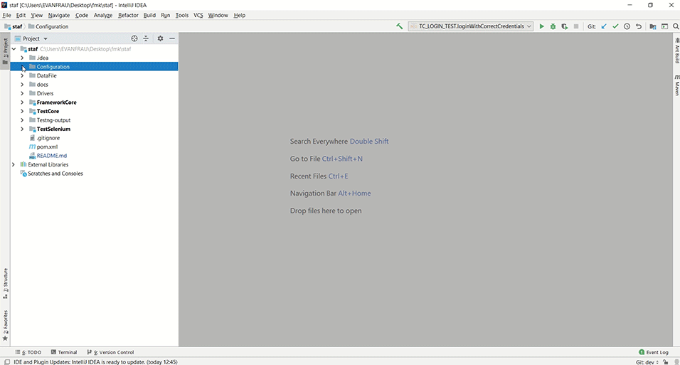
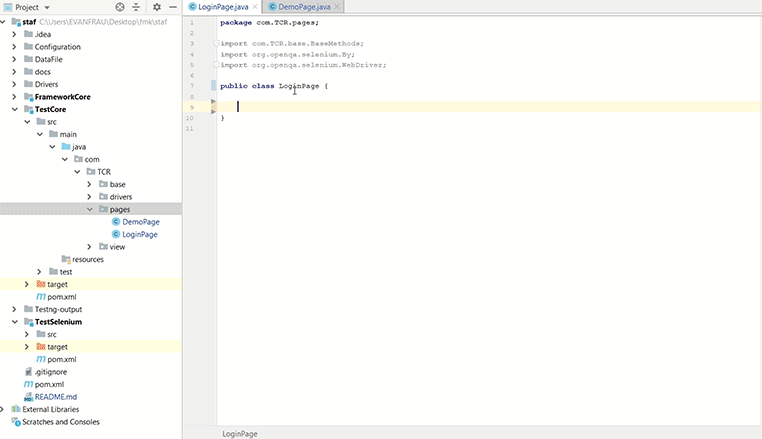
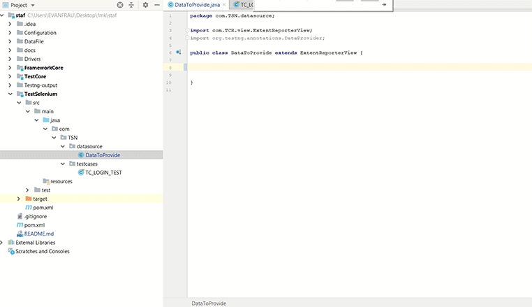
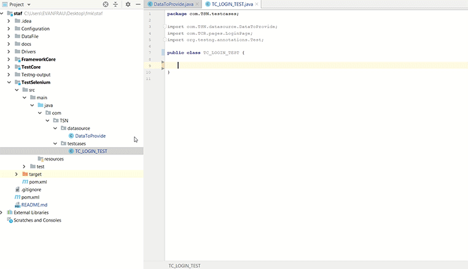

### Table of Contents

- [Introduction](#introduction)

- [Technologies](#technologies)

- [Architecture](#architecture)

- [Implementation](#implementation)

- [Next steps](#next-steps)

---

# Introduction

See infos in MS teams.

### What is it ?

**_TODO_**

### For who ?

**_TODO_**

### What (basic) knowledge do I need ?

**_TODO_**

# Technologies

### IDE

This project has been realized with **IntelliJ IDEA Community** from **JetBrains**.

You can also use **Eclipse**.

### Java & JDK

We use Java as programming language.

You need to have the _Java Development Kit (JDK)_ to be able to run the code.

Configuration:

- **JDK_HOME** environment variable

- **JAVA_HOME** environment variable

- Environment variable must point to the JDK installation home directory

> C:\Program Files\Java\jdk1.8.0_121

_Example path_

### Maven

Maven is a build automation tool. It can build a project and manages its dependencies.

Maven use an approach _"convention over configuration"_.

It means a project should be structured:

```
🗁 my-app
├── 🗎 pom.xml
└── 🗁 src
    ├── 🗁 main
    │   └── 🗁 java
    │       └── some/packages
    └── 🗁 test
        └── 🗁 java
            └── some/packages
```

In a Maven project, We have:

- pom.xml (file that describe/configure a Maven project)

- src/main/java

- src/test/java

You can download and install maven here: [https://maven.apache.org/download.cgi](https://maven.apache.org/download.cgi)

### Libraries used

| Library       | Description                         |
| ------------- | :---------------------------------- |
| Apache Poi    | helps to read and write Excel files |
| Selenium      | helps to interact with web browsers |
| TestNG        | Testing library                     |
| Junit         | Testing library                     |
| ExtentReports | generates reports                   |

# Architecture

Since our previous Framework didn't follow any proper structure, it was difficult to understand, maintain and divide in tasks the project. So, we decide to follow an architecture and principles that will help us build the project with best practices. It also allow us to become better testers/developers.

### S.O.L.I.D principles

SOLID is an acronym which takes 5 important design principles in Object Oriented Programming. It's defined by **Robert Cecil Martin** in _Design Principles and Design Patterns_ however the acronym was identified by **Michael Feathers**, Author of _Working Effectively with Legacy Code_.

It's mainly a set of recommendations that we have to apply to our code so that it is more robust, easier to maintain, reusable and extensible.

> Also known as **Uncle Bob**, Robert C. Marting is also one of the founders of the Agile manifesto.

**Single Responsibility Principle (SRP)**

This principle means assigning a class only one responsibility and therefore having only one task to accomplish. It also means that we reduce the degree of dependency.

**Open/Closed Principle (OCP)**

This principle means the project must be easily expandable. We can add new features (open) without having to modify the existing code (closed).
Abstraction as interfaces and polymorphism can help apply this.

**Liskov Substitution Principle (LSP)**

Defined by **Barbara Liskov**, this principle states that objects must be replaceable by instances of their child classes without altering the proper functioning of the system.

**Interface Segregation Principle (ISP)**

This principle states that it is preferable to have several specific interfaces rather than a single general interface. In this way, we will be less inclined to find methods that we will not implement.

**Dependency Inversion Principle (DIP)**

This principle means that a concrete class must not depend directly on another class but on an abstraction of this class. This is why interfaces are used to satisfy this principle. We reduce the dependencies and make the code more reusable. We want to inject the dependencies into the constructor and avoid initializing them whenever we need them. The **Dependency Injection** pattern helps to implement this principle.

## Clean Architecture

To respect the principles outlined above, a good architectural approach to the separation of concepts would be the "Clean Architecture" of our friend **Uncle Bob**.

His philosophy is to promote the independence of the layers.

According to him, the architecture must clearly expose the intentions of the system and not the frameworks.

The Idea is that we must be able to understand the subject of the application just by looking at the project regardless of the the technology used.

It's also a way of thinking: we wonder what parts are likely to change and how hard it will be to implement this change.
The strength of this architecture is that everything is an implementation detail.

We must be able to change an implementation without the business logic noticing it.



#### Rule of Dependency

the more the layer is external, the more this layer is likely to change.



FMKCore is the module that cannot be dependent on TestCore and/or TestSelenium.
It means each layer only interacts with the layer immediately below it.



> When you are in **TestSelenium**, you can use methods from **TestCore**.

> When you are in **TestCore**, you can use methods from **FMKCore**.

> When you are in **FMKCore**, you can't use methods from **TestCore** or **TestSelenium**.

### Design Patterns applied to architecture

Design patterns represent the best practices adopted by experienced object-oriented software developers. Design patterns are solutions to general problems that software developers faced during software development.

#### MVC Pattern (adapted)

The main idea is to separate data access, user/system interactions and the views (testcases/reports).


##### Model

It contains test data represented by objects.

##### Controller

It is the intermediary between view and controller.
It configures, gets the test data from the model and make them available for the test cases.

##### View

Its responsibility is to run/display the test cases and generate the report based on the test cases written by the testers.

#### Repository pattern

The idea of this pattern is to make transparent the recovery of data. So the data can come from an Excel file or a CSV file.

#### Factory pattern

This pattern is to help us with the creation of an object at runtime without the client needing to know the internal implementation details (not even the name of the class).

#### Method chaining

This pattern can help us to write complex objects step by step and improve the readability of method calls.

Instead of doing this

```Java
public LoginPage writeEmail(String email) {
    writeText(emailInput,email);
}

public LoginPage writePassword(String pass) {
    writeText(passInput,pass);
}

loginPage.writeEmail("example@email.com");
loginPage.writePassword("mypassword");
...
```

Return the current object instance with _this_

```Java
public LoginPage writeEmail(String email) {
    writeText(emailInput,email);
    return this;
}

public LoginPage writePassword(String pass) {
    writeText(passInput,pass);
    return this;
}

loginPage.writeEmail("example@email.com")
         .writePassword("mypassword");
...
```

#### Page Object Model

Each screen of an application is represented as an Object.

#### Modules

This is a Maven multi-module project.

```
🗁 my-app
├── 🗎 pom.xml (parent)
├── 🗁 FMKCore
│    ├── 🗎 pom.xml (children)
│     └── 🗁 src
├── 🗁 TestCore
│    ├── 🗎 pom.xml (children)
│    └── 🗁 src
├── 🗁 TestSelenium
     ├── 🗎 pom.xml (children)
     └── 🗁 src
```

You define your module in the _parent_

```xml
 <modules>
        <module>FrameworkCore</module>
        <module>TestCore</module>
        <module>TestSelenium</module>
    </modules>
```

To interact between modules, you just need to add the module as a dependency

```xml
 <dependencies>
        <dependency>
            <groupId>staf</groupId>
            <artifactId>TestCore</artifactId>
            <version>1.0-SNAPSHOT</version>
            <scope>compile</scope>
        </dependency>
        ...
    </dependencies>
```

# Implementation

Explanation of the implementation module per module.

### FMKCore module

This module retrieve the data and build the features with test cases

#### Configuration

We use properties files to help with the general configuration of the project.

```
baseUrl = website_we_want_to_test.com
dataPath = provide/path_data_file.xlsx
```

The class _ConfigReader_ will read the properties files thanks to the _getProperty_ method.

```Java
readConfig.getProperty(DATA_PATH);
```

#### Read Data

The class _FeatureRepositoryImpl_ implements the interface _FeatureRepository_.

```Java
public interface FeatureRepository {
    Map<String, Feature> getFeatures(String path) throws IOException;
}
```

_FeatureRepositoryImpl_ uses the library Apache Poi to read data from excel files.

Each excel sheet represents a feature with multiple test cases.

```Java
Public class Feature {
    private String name;
    //Key = id
    private Map<String, TestCase> testCases;
    ...
}
```

#### Send data

The class _FmkController_ gets the data from the _FeatureRepository_ based on the path written in _Config.properties_.

```Java
public Map<String, Feature> getFeatures() throws IOException {
    return featureRepository.getFeatures(PROJECT_PATH + readConfig.getProperty(DATA_PATH));
}
```

_FmkController_ will be instantiated in the class _BaseTest_ to make the test data available for the test cases.

### TestCore module

This module will get the features data provided by FMKCore, configure the selenium drivers, configure the report and provides methods that helps the tester to build his test cases.

#### Configure Drivers

Before using the framework, ensure that the version of the chromedriver is the same as your Chrome browser.

**_TODO_**

#### Prepare ExtentReport

**Extent Report** is a HTML reporting library for Selenium WebDriver for Java which is to a great degree simple to use and makes excellent execution reports. We can use this tool within our TestNG, JUnit, NUnit automation framework. As an automation tester, its obligation to catch great reporting and present to administration group.

Extent Reports is an open-source reporting library which can be easily integrated with all testing frameworks.

These reports are high rich HTML reports. It provides results in the form of PIE charts. Using Extent Reports, we could generate custom logs, add snapshots. We can use external XML file to provide extra information.

We can provide below information to the report using XML file:

- Report Title

- Report Name

- Report Headline

- Environment Information

- Host Name

- User Name

- Date Format

- Time Format

#### BaseMethods

| Method                      | Description                                                                 | status |
| --------------------------- | :-------------------------------------------------------------------------- | :----: |
| waitVisibility              | Wait for a specified amount of time for an element to appear                |  done  |
| click                       | Click on an element                                                         |  done  |
| hover                       | hover an element for a specified time                                       |  done  |
| read                        | Read the text value of an element                                           |  done  |
| writeText                   | Write a specific text into an element                                       |  done  |
| getWebElement               | Return the webElement linked to a specified By object                       |  done  |
| getWebElements              | Return a list of webElements linked to the specified By object              |  done  |
| writeToConsole              | Write the value of an element into the console                              |  done  |
| AssertEquals                | Assert whether an element has the specified value                           |  done  |
| AssertPresence              | Assert whether an element is present on a page                              |  done  |
| AssertUrl                   | Assert whether your current page URL is the same as a specified one         |  done  |
| AssertSame                  | Assert whether two elements are completely identical                        |  done  |
| SelectItemInDropdownByIndex | Selects a specified object in a specified dropdown menu by its index        |  done  |
| SelectItemInDropdownByText  | Selects a specified object in a specified dropdown menu by its visible text |  done  |
| SelectItemInDropdownByValue | Selects a specified object in a specified dropdown menu by its value        |  done  |
| PerformAction               | Perform a single action to a list of elements                               |  done  |
| takeScreenshot              | Screenshot after every step. (replace after each step)                      |  todo  |
| clearText                   | Clear text from a given element                                             |  done  |
| AssertAlphabetical          | Assert whether a given list is order alphabetically                         |  done  |
| AssertIsDisplayed           | Assert whether a specified object is visible                                |  done  |
| close                       | Close the browser and erase the cookies                                     |  done  |
| MoveToElement               | Moves to the element with the mouse. (Is useful for scrolling or dropdowns) |  todo  |
| Scroll                      | Scrolls down or up on the corresponding window or frame                     |  todo  |
| fileUpload                  | Upload a file using the path in your system                                 |  todo  |

### TestSelenium module

In this module, the tester will create the pages of the application, write the test cases and link the test data with them.

#### Provide Data

**_TODO_**

#### Create Pages

Using the design pattern **Page Object Model**, the tester creates the pages of the application.
We use the builder pattern

#### Write Test cases

**_TODO_**

# How the tester will use the Framework?

The tester will have to complete a certain numbers of steps to use the framework.

## 4 directories will be involved

- Configuration
- DataFile
- TestCore
- TestSelenium



## 1. Add sheets/features and writes test cases according to the format (ID, test step, test data, expected result, ID prerequisite)

_Format of test data -> nameElement\[data,data,data,...];otherElement\[data,data,data];..._



## 2. Provide the **URL** of the web application and the **path** of the excel file



## 3. Create the pages of the web application

1. Create a object and extends _BaseMethods_

```Java
public class ExamplePage extends BaseMethods{

    public ExamplePage(WebDriver driver) {
        super(driver);
    }
}

```

2. Add the elements of the page as member fields

```Java
private By textField = By.id("element_id");
private By button = By.xpath("element/xpath");
...
```

3. Add methods that represent actions using the methods from _BaseMethods_ and should respect the _method chaining_ (optional)

```Java
public ExamplePage writeSomeText(String text) {
    // methods from BaseMethods
    writeText(textField, text);
    // method chaining
    return this;
}
...
```

4. Navigates to another page (if needed)

```Java
public OtherPage navigateToOtherPage() {
    // should pass driver as argument
    return new OtherPage(driver);
}
```

5. Assert using methods from BaseMethods

```Java
public void assertSomething(String expectedUrl) {
    // methods from BaseMethods
    assertUrl(expectedUrl);
}
```



## 4. Provide data to testCases in **DataToProvide**

Use the annotation _@DataProvider_ from the method _fetchData_

```Java
@DataProvider
public static Object[][] data_login() {
    return fetchData("featureName", "testCaseID");
}
...
```



## 5. Write the Test Cases

1. Create a test suite class and extends _DataToProvide_

```Java
public class TC_LOGIN_TEST extends DataToProvide {
    ...
}
```

2. Write a method using the annotation _@Test_ and provide test data

```Java
@Test(dataProvider ="data_login")
public void loginWithCorrectCredentials(String email, String password) {
    new LoginPage(driver) // use the page object
        .goToBaseUrl(baseUrl)
        .writeEmail(email)
        .writePassword(password)
        .clickLoginButton()
        .navigateToDemoPage()
        .assertCorrectPage("expectedUrl");
}
...
```

3. Run the test case(s)



4. After the run, it would generate a report in the **Testng-output** folder.

## Exercises:
Navigate to the website under test http://automationpractice.com/index.php and automate the following functionalities:

### Search functionality:
* Using the POM principles, refactor the Then step from the @search scenario, according to the principles (follow the same rules as already done for the `When`)
* Convert the already created scenario into a scenario outline so more products can be searched on, at once. What do you experience here?
* Search for a product that doesn't exist and validate the error message received
* Use the advanced search functionality (e.g. type "dress" and select from the list of recommendations "Casual Dresses > Printed")

### Sorting functionality:
* Check that you can sort based on the prices (lowest to highest)
* Check that you can sort based on the name of produts from Z-A 

### Registration/ Login
* Register to the website by providing a valid email address and filling in all the mandatory field
* Check the errror messages received in case mandatory fields are not filled in
* Validate the error message received in case you try to register with an existing email
* Try to login with a wrong pair of email/password
* Login successfully to the website

### Shopping cart
* Add a product to a cart and order it successfully by filling in all the required info (as an authenticated user)
* Add a product to a cart and order it successfully by filling in all the required info (without being authenticated)

### Technical improvements for the framework
* Create html reports while running your scripts
* Create profiles (cucumber.yml files) that will allow you to run the scripts in various browsers
* Add extra configuration in the env.rb files for other browsers (e.g. Edge, IE11)
* In the hooks.rb file add an after hook with allows you to add screenshots in case scenarios fail
 
### Use Jenkins to run your scripts (Advanced)
* Configure a jenkins agent locally 
* Create pipelines for various browsers and run the scripts
* Use the groovy script from pipelines > demo_pipeline as an example on how to configure your pipelines in Jenkins


